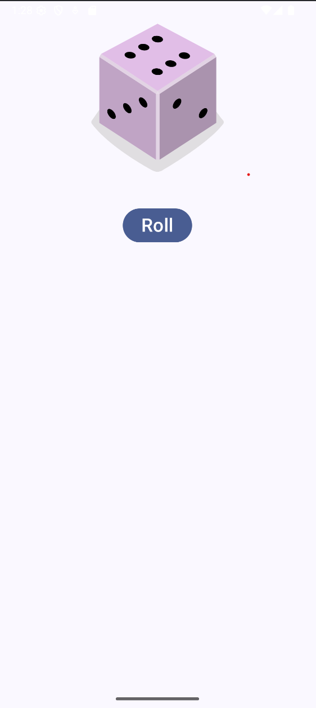

# 🎲 Dice Roller App

A simple Android app that simulates the roll of a dice. Built using **Kotlin** and **Jetpack Compose**, the app displays a dice image and changes it when the "Roll" button is pressed.

---

## 📱 Features

- Tap a button to roll a dice.
- Displays a corresponding dice face (1–6) image.
- Uses Jetpack Compose for a modern declarative UI.
- Clean and minimal UI with Material3.

---

## 🛠️ Built With

- Kotlin
- Jetpack Compose
- Material3 Design Components
- Android Studio

---

## 📷 Screenshots

| Initial State | After Roll |
|---------------|------------|
|  |  |

> Note: Screenshots are just sample references. Replace with actual emulator screenshots or remove this section if not needed.

---

## 🧑‍💻 How It Works

- When the app starts, the dice shows the face of 1.
- When the user clicks the **Roll** button, the dice face updates randomly from 1 to 6 using Kotlin’s `(1..6).random()` function.
- Each dice face corresponds to an image stored in `res/drawable`.

